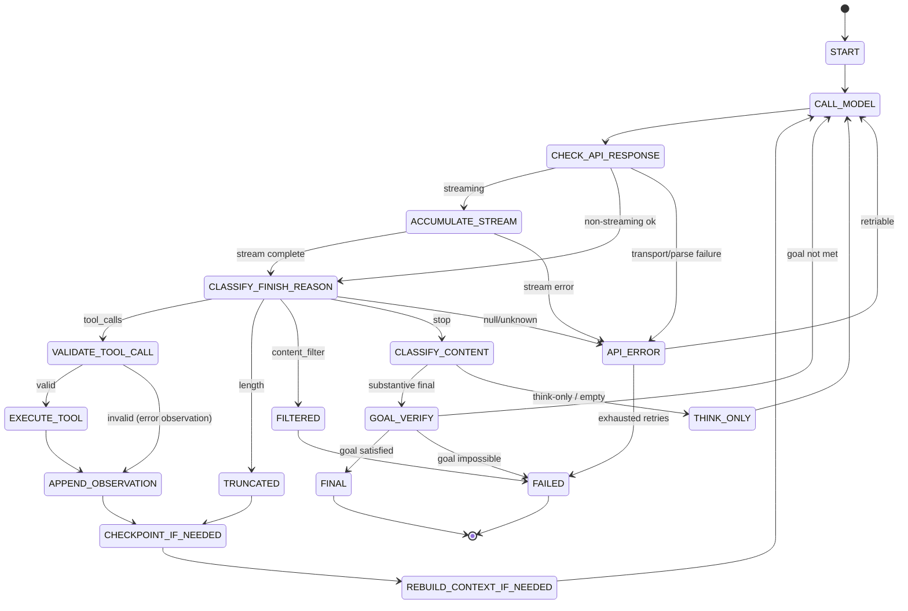

# Codra Long-Horizon Agent Loop — Architecture Design

Research date: 2026-06-11  
Reference: [MiMo Code: Long-Horizon Agent Blog](https://mimo.xiaomi.com/zh/blog/mimo-code-long-horizon)  
Codra repo: `/root/projects/codra`  
Related: [MIMOCODE_ARCHITECTURE_NOTES.md](./MIMOCODE_ARCHITECTURE_NOTES.md)

**Scope:** Architecture planning only. No MiMo source code copied. No branding copied. No product implementation in this document.

---

## What MiMo Teaches

The headline is not “million-token context.” The durable lesson is:

> **The model is stateless. The runtime must provide continuity.**

MiMo Code explains that coding agents work by repeatedly calling a language model inside a **runtime harness**. Each model invocation starts fresh. The runtime owns tools, persistence, prompt assembly, and the decision of what happens next. As tasks stretch across dozens or hundreds of steps, two failures dominate:

1. **Context exhaustion** — tool output, logs, and code fragments fill the window; naive summarization loses recoverable detail.
2. **Instruction dilution** — constraints and intent get buried inside tool observations; the model’s ability to follow instructions degrades as input grows.

MiMo’s response organizes around three themes — **compute, memory, evolution** — but the foundation for all three is the same harness loop shown in their state-machine diagram (Figure 1): every API response is classified, every finish reason is routed, and the loop only stops when the runtime agrees the task is truly complete.

For Codra, this is the architectural upgrade that matters most: **long-horizon reliability through a formal agent loop**, not another UI panel.

### MiMo harness loop (conceptual)

```
START
  ↓
CALL_MODEL
  ↓
Check API response
  ↓
CLASSIFY_FINISH_REASON
  ↓
route by finish reason:
  tool_calls / function_call → validate → execute → append observation → loop
  length                    → truncated → checkpoint/rebuild hooks
  content_filter            → filtered → stop or fallback
  stop                      → classify content → final or think-only nudge
  api error                 → retry with policy
```

This is not a chat loop. It is a **state machine** with explicit failure semantics.

---

## Codra Today vs What We Need

Codra already has a **task lifecycle** state machine (`Draft → Planning → AwaitingApproval → Approved → Executing → Verifying → Completed`) persisted in `.codra/tasks/*.json`. That machine governs *supervised workflow phases* — plan approval, verification, repair.

What Codra lacks is a **model-call loop** state machine inside `Executing` (and future autonomous modes): the per-turn harness that decides whether to call tools, retry, checkpoint, or accept a final answer.

These are **two layers**:

| Layer | Owns | Example states |
|-------|------|----------------|
| **Task lifecycle** (`codra-core` / `TaskLifecycle`) | User-visible workflow, approvals, verification | `awaiting_approval`, `verifying` |
| **Agent loop** (new) | Per-model-call routing inside a task | `classify_finish_reason`, `execute_tool` |

The UI must **observe** both layers via task events and timeline SSE — it must **not** own agent loop state.

Existing hooks to align with:

- `GenerationResponse.finish_reason` in `codra-protocol`
- `IntelligenceProvider::generate` in `codra-core/src/provider.rs`
- Tool registry in `codra-tools`
- Task events JSONL under `.codra/tasks/events/`

---

## Codra Agent Loop State Machine

### States

| State | Purpose |
|-------|---------|
| `START` | Initialize loop context for a task turn batch |
| `CALL_MODEL` | Invoke provider with assembled prompt |
| `CHECK_API_RESPONSE` | Validate HTTP/transport success, parse body |
| `ACCUMULATE_STREAM` | Merge streaming chunks into a single logical response |
| `CLASSIFY_FINISH_REASON` | Map provider finish reason → route enum |
| `VALIDATE_TOOL_CALL` | Schema, allowlist, workspace boundary, capability checks |
| `EXECUTE_TOOL` | Run tool through capability layer |
| `APPEND_OBSERVATION` | Append tool result to turn history |
| `CHECKPOINT_IF_NEEDED` | Trigger checkpoint writer at budget thresholds |
| `REBUILD_CONTEXT_IF_NEEDED` | Rebuild prompt window from structured memory |
| `CLASSIFY_CONTENT` | On `stop`: detect final answer vs think-only vs empty |
| `GOAL_VERIFY` | Independent judge compares work against task goal |
| `FINAL` | Emit completion; hand off to task lifecycle |
| `THINK_ONLY` | Nudge model — no durable completion |
| `API_ERROR` | Classify retriable vs fatal provider errors |
| `TRUNCATED` | Handle `length` finish reason |
| `FILTERED` | Handle `content_filter` finish reason |
| `FAILED` | Terminal error with persisted reason |

### State diagram (core path)



---

## State Transitions (Detailed)

### `START`

| Field | Value |
|-------|-------|
| **Input** | `task_id`, workspace path, optional goal text, loop config (retry budget, checkpoint thresholds) |
| **Output** | `AgentLoopContext` initialized; turn counter = 0 |
| **Next** | `CALL_MODEL` |
| **Failure** | Missing task → `FAILED` |
| **Persist** | `agent_loop.started` event to task JSONL |

### `CALL_MODEL`

| Field | Value |
|-------|-------|
| **Input** | Assembled messages (system + memory injection + observations + user tail) |
| **Output** | Provider request dispatched |
| **Next** | `CHECK_API_RESPONSE` (or `ACCUMULATE_STREAM` if streaming) |
| **Failure** | Config error → `FAILED` |
| **Persist** | `agent_loop.model_call` event (provider id, token estimate; no raw secrets) |

### `CHECK_API_RESPONSE`

| Field | Value |
|-------|-------|
| **Input** | Raw HTTP response or stream handle |
| **Output** | Parsed `GenerationResponse` or structured error |
| **Next** | `CLASSIFY_FINISH_REASON` on success; `API_ERROR` on failure |
| **Failure** | Malformed JSON, empty choices → `API_ERROR` |
| **Persist** | `agent_loop.api_response` with status code / error class |

### `ACCUMULATE_STREAM`

| Field | Value |
|-------|-------|
| **Input** | Stream chunks (`delta.content`, `delta.tool_calls`, finish markers) |
| **Output** | Single merged `GenerationResponse` |
| **Next** | `CLASSIFY_FINISH_REASON` when `finish_reason` present; stay in state while chunks arrive |
| **Failure** | Stream abort, null-only chunks past timeout → `API_ERROR` |
| **Persist** | Optional `agent_loop.stream_progress` heartbeat (throttled) |

### `CLASSIFY_FINISH_REASON`

| Field | Value |
|-------|-------|
| **Input** | `finish_reason: Option<String>`, content, tool call payloads |
| **Output** | `FinishRoute` enum (see below) |
| **Next** | Route-specific state |
| **Failure** | Unknown/null finish with no content and no tools → `API_ERROR` |
| **Persist** | `agent_loop.finish_classified` with route label |

### `VALIDATE_TOOL_CALL`

| Field | Value |
|-------|-------|
| **Input** | Parsed tool name + arguments |
| **Output** | `ValidatedToolCall` or validation error |
| **Next** | `EXECUTE_TOOL` if valid; `APPEND_OBSERVATION` with validation error if invalid |
| **Failure** | Never crashes loop — invalid calls become observations |
| **Persist** | `agent_loop.tool_validated` / `agent_loop.tool_rejected` |

Validation rules (Codra-specific):

- Tool must exist in `codra-tools` registry
- Arguments must match tool JSON schema
- Paths must resolve inside workspace boundary
- Mutations respect `SafetyMode` and approval gates
- Disallowed tools return structured rejection (not shell execution)

### `EXECUTE_TOOL`

| Field | Value |
|-------|-------|
| **Input** | `ValidatedToolCall` |
| **Output** | `ToolObservation` (typed, deterministic schema) |
| **Next** | `APPEND_OBSERVATION` |
| **Failure** | Tool runtime error → observation with `success: false` (loop continues) |
| **Persist** | `agent_loop.tool_executed` + full observation in turn buffer (redact secrets) |

**All execution passes through the capability layer** (`codra-tools` + `codra-core` safety filters). No direct shell from parsed model text.

### `APPEND_OBSERVATION`

| Field | Value |
|-------|-------|
| **Input** | Tool result or validation error |
| **Output** | Updated in-memory turn history |
| **Next** | `CHECKPOINT_IF_NEEDED` |
| **Failure** | Serialization error → `FAILED` (should not happen with typed tools) |
| **Persist** | Append to task history JSONL **before** next `CALL_MODEL` |

### `CHECKPOINT_IF_NEEDED`

| Field | Value |
|-------|-------|
| **Input** | Context utilization estimate (tokens / budget %) |
| **Output** | Optional checkpoint job dispatched |
| **Next** | `REBUILD_CONTEXT_IF_NEEDED` |
| **Failure** | Checkpoint writer failure is non-fatal — log and continue |
| **Persist** | Writer updates `.codra/checkpoint.md` (later PR); event `agent_loop.checkpoint_triggered` |

MiMo-aligned thresholds (configurable defaults):

- ~20% context used → checkpoint
- ~45% → checkpoint
- ~70% → checkpoint
- Near limit → rebuild (next state)

### `REBUILD_CONTEXT_IF_NEEDED`

| Field | Value |
|-------|-------|
| **Input** | Checkpoint files + memory layers + recent user messages |
| **Output** | New prompt window under budget cap |
| **Next** | `CALL_MODEL` |
| **Failure** | Rebuild failure → `FAILED` with resume instructions |
| **Persist** | `agent_loop.context_rebuilt` + history session file |

### `CLASSIFY_CONTENT`

| Field | Value |
|-------|-------|
| **Input** | `stop` response content |
| **Output** | `ContentClass`: `final_answer` \| `think_only` \| `empty` \| `question` |
| **Next** | `GOAL_VERIFY` if substantive final; `THINK_ONLY` if no actionable result |
| **Failure** | — |
| **Persist** | `agent_loop.content_classified` |

**Think-only stop must not be treated as completion.** Examples: chain-of-thought with no tool calls and no deliverable, “I should check…” with no follow-up action.

### `GOAL_VERIFY`

| Field | Value |
|-------|-------|
| **Input** | Goal text, turn history summary, verification outputs |
| **Output** | `GoalVerdict`: `complete` \| `incomplete` \| `impossible` |
| **Next** | `FINAL` if complete; `CALL_MODEL` with gap feedback if incomplete; `FAILED` if impossible |
| **Failure** | Judge provider error → retry judge once, then `API_ERROR` |
| **Persist** | `agent_loop.goal_judged` with reason |

Skipped when no goal is set (MVP: proceed to `FINAL` with task-lifecycle verification only).

### `FINAL`

| Field | Value |
|-------|-------|
| **Input** | Accepted final content |
| **Output** | Loop exit signal to task lifecycle |
| **Next** | Task lifecycle transitions (e.g. → `verifying`) |
| **Failure** | — |
| **Persist** | `agent_loop.completed` |

### `THINK_ONLY`

| Field | Value |
|-------|-------|
| **Input** | Prior content |
| **Output** | Nudge prompt appended (“continue — produce tool calls or a final answer”) |
| **Next** | `CALL_MODEL` |
| **Failure** | Exceed max nudge count → `FAILED` (stuck loop guard) |
| **Persist** | `agent_loop.nudge` |

### `API_ERROR`

| Field | Value |
|-------|-------|
| **Input** | Error class (429, 5xx, timeout, parse) |
| **Output** | Retry decision |
| **Next** | `CALL_MODEL` with backoff if retriable and budget remains; else `FAILED` |
| **Failure** | Retry budget exhausted |
| **Persist** | `agent_loop.api_retry` / `agent_loop.api_failed` |

Default retry policy: exponential backoff, max 3 retries for 429/5xx/timeout, no retry for 401/403.

### `TRUNCATED`

| Field | Value |
|-------|-------|
| **Input** | `length` finish reason, partial content |
| **Output** | Partial content preserved |
| **Next** | `CHECKPOINT_IF_NEEDED` (always treat as pressure signal) |
| **Failure** | — |
| **Persist** | `agent_loop.truncated` |

### `FILTERED`

| Field | Value |
|-------|-------|
| **Input** | `content_filter` finish reason |
| **Output** | Safety stop |
| **Next** | `FAILED` (or user-approved fallback in future) |
| **Failure** | — |
| **Persist** | `agent_loop.content_filtered` |

### `FAILED`

| Field | Value |
|-------|-------|
| **Input** | Terminal error |
| **Output** | Task lifecycle `mark_task_failed` |
| **Next** | — |
| **Failure** | — |
| **Persist** | `agent_loop.failed` with structured reason |

---

## Finish Reason Handling

| Finish reason | Codra route | Next state(s) | Notes |
|---------------|-------------|---------------|-------|
| `tool_calls` | `ToolCalls` | `VALIDATE_TOOL_CALL` | OpenAI-style parallel tool calls |
| `function_call` | `FunctionCall` | `VALIDATE_TOOL_CALL` | Legacy single-call; normalize to same path |
| `stop` | `Stop` | `CLASSIFY_CONTENT` | May be final, think-only, or question |
| `length` | `Truncated` | `TRUNCATED` → checkpoint/rebuild | Never treat as success |
| `content_filter` | `Filtered` | `FILTERED` → `FAILED` | Log for audit |
| `null` / missing (non-streaming) | `Indeterminate` | `API_ERROR` if no content/tools | Streaming may be in progress |
| API HTTP error | `ApiError` | `API_ERROR` | Classify retriable |
| Streaming null chunks only | `StreamStall` | `API_ERROR` after timeout | Distinguish from slow models |

### Pure classifier functions (PR 1 deliverable)

These should be **pure, testable, provider-agnostic**:

```typescript
// packages/shared/agent-loop.ts (proposed)

type FinishRoute =
  | "tool_calls"
  | "function_call"
  | "stop"
  | "length"
  | "content_filter"
  | "api_error"
  | "indeterminate";

function classifyFinishReason(
  finishReason: string | null | undefined,
  content: string,
  toolCalls: ToolCallPayload[]
): FinishRoute;

function classifyContent(
  content: string,
  hadToolCallsInTurn: boolean
): "final_answer" | "think_only" | "empty" | "question";

function shouldRetryApiError(
  error: ApiErrorClass,
  attempt: number,
  maxAttempts: number
): boolean;
```

Rust mirror in `codra-protocol` or `codra-core/src/agent_loop/` for runtime ownership.

---

## Codra-Specific Rules

1. **Tool calls validated before execution** — invalid calls become error observations, not panics.
2. **All tool execution through capability layer** — `codra-tools` registry + `SafetyMode` + approval gates.
3. **Observations appended to task history before looping** — never call the model on stale history.
4. **Final answer checked against goal when goal exists** — `GOAL_VERIFY` is mandatory before `FINAL`.
5. **Think-only stop is not completion** — route to `THINK_ONLY` → nudge → `CALL_MODEL`.
6. **API errors retry with bounded policy** — no infinite loops; persist each attempt.
7. **Length/truncation triggers checkpoint + rebuild** — never silently continue with truncated plans.
8. **UI does not own agent loop state** — React/Tauri UI renders timeline events only; `codra-core` owns the loop.

### Single-writer memory rule (for later PRs)

| File | Writer |
|------|--------|
| `.codra/notes.md` | Main agent (append only) |
| `.codra/checkpoint.md` | Writer subagent |
| `.codra/MEMORY.md` | Writer subagent |
| `.codra/history/session-*.jsonl` | Runtime |
| Tool observations | Tool executor via runtime |

### Four-layer memory (for later PRs)

| Layer | Path | Lifetime |
|-------|------|----------|
| Session | `.codra/checkpoint.md` | Current logical session |
| Project | `.codra/MEMORY.md` | Workspace-durable |
| Task | `.codra/tasks/<task-id>/progress.md` | Per task |
| History | `.codra/history/session-*.jsonl` | Full trace fallback |
| Global | `~/.codra/MEMORY.md` | User preferences cross-project |

Task JSON (`.codra/tasks/*.json`) remains **machine source of truth** for lifecycle state; markdown layers are projections (see [MIMOCODE_ARCHITECTURE_NOTES.md](./MIMOCODE_ARCHITECTURE_NOTES.md)).

---

## MiMo Patterns to Adapt Later

These are valuable but **out of scope for the first PR**:

| Pattern | MiMo idea | Codra adaptation |
|---------|-----------|------------------|
| **Max Mode** | Parallel candidate sampling + judge | `codra build --max-mode` experimental flag |
| **Goal verification** | Independent judge on stop | `GOAL_VERIFY` state + `codra goal` command |
| **Dynamic Workflow** | JS workflow scripts in sandbox | `codra compose` recipe runner (Rust-native) |
| **Checkpoint writer subagent** | Independent extractor | Background writer in `codra-core` |
| **Four-layer memory** | checkpoint / MEMORY / global / history | `.codra/` layout above |
| **Dream / Distill** | Periodic memory cleanup + skill extraction | `codra dream`, `codra distill` (approval-gated) |
| **Budgeted rebuild injection** | Per-section token caps | `MemoryBudget` config in core |
| **Restricted tool syntax** | Shell-like tool grammar | Evaluate after loop is stable |

---

## Codra Roadmap (Recommended PR Order)

| PR | Title | Scope |
|----|-------|-------|
| **1** | `feat(agent-loop): add finish reason state machine` | Types, pure classifiers, tests — **no runtime wiring** |
| **2** | `feat(agent-loop): wire harness into task executor` | `CALL_MODEL` → tool loop inside `Executing` |
| **3** | `feat(agent-loop): goal verification` | `GOAL_VERIFY` + `codra goal` |
| **4** | `feat(memory): checkpoint files` | `.codra/checkpoint.md`, `MEMORY.md`, `notes.md`, history |
| **5** | `feat(agent-loop): context rebuild` | `REBUILD_CONTEXT_IF_NEEDED` + budgeted injection |
| **6** | `feat(memory): writer subagent` | Independent checkpoint writer; single-writer enforcement |
| **7** | `feat(memory): dream and distill` | Periodic cleanup + recipe extraction |

PR 1 is intentionally first: memory and checkpointing need a loop that knows **when** to checkpoint, **when** to retry, **when** to reject early finals, and **how** to route tool calls. A memory layer without a disciplined harness risks persisting the wrong state.

---

## First Implementation PR Proposal

### `feat(agent-loop): add finish reason state machine`

**Goal:** Introduce the agent loop domain model and pure routing functions without changing runtime behavior.

### Deliverables

| Area | Files (proposed) | Content |
|------|------------------|---------|
| Shared types | `packages/shared/agent-loop.ts` | States, `FinishRoute`, `ContentClass`, `GoalVerdict`, transition table |
| Protocol mirror | `crates/codra-protocol/src/agent_loop.rs` | Serde types exported to TS via existing sync or manual parity |
| Classifiers | `packages/shared/agent-loop-classifier.ts` | `classifyFinishReason`, `classifyContent`, `shouldRetryApiError`, `nextState` |
| Tests | `packages/shared/agent-loop.test.ts` | Table-driven tests for every finish reason and edge case |
| Docs | This file | Reference architecture |

### Explicitly out of scope for PR 1

- Wiring into `task_executor.rs` or `provider.rs`
- Checkpoint writer, memory files, rebuild injection
- Goal judge provider calls
- UI timeline changes
- Streaming accumulator implementation (types only)

### Test cases (minimum)

- `tool_calls` → `VALIDATE_TOOL_CALL`
- `function_call` → `VALIDATE_TOOL_CALL` (legacy normalization)
- `stop` + deliverable content → `CLASSIFY_CONTENT` → `GOAL_VERIFY` path
- `stop` + think-only → `THINK_ONLY`
- `length` → `TRUNCATED` → checkpoint hook flag set
- `content_filter` → `FILTERED` → `FAILED`
- `null` finish + empty content → `API_ERROR`
- `null` finish + tool calls present → `VALIDATE_TOOL_CALL`
- 429 → retry true (attempt 1); retry false (attempt 4)
- 401 → retry false

### Acceptance criteria

- All classifier tests pass via `pnpm test` / `npm test` in `packages/shared`
- `scripts/check-task-loop-protocol-sync.mjs` updated if protocol types added
- No change to existing task lifecycle transitions
- No user-visible behavior change

---

## Relationship to Existing Codra Docs

| Document | Relationship |
|----------|--------------|
| [AGENT_TASK_LOOP.md](../AGENT_TASK_LOOP.md) | Task lifecycle — complementary outer loop |
| [ARCHITECTURE.md](../ARCHITECTURE.md) | `codra-core` owns orchestration; this doc details inner loop |
| [MIMOCODE_ARCHITECTURE_NOTES.md](./MIMOCODE_ARCHITECTURE_NOTES.md) | Memory/checkpoint/dream patterns — downstream of PR 1 |
| [RUNTIME_ADAPTER_ARCHITECTURE.md](../RUNTIME_ADAPTER_ARCHITECTURE.md) | Provider + tool boundaries this loop must respect |

---

## Must-Never Rules

1. **Never** treat UI state as agent loop state.
2. **Never** execute tools without validation and capability-layer routing.
3. **Never** accept `stop` as completion without content classification (and goal verify when goal exists).
4. **Never** copy MiMo source, branding, or hosted-service integrations.
5. **Never** persist durable memory only in chat history.
6. **Never** skip observation append before the next model call.

---

## Summary

| Item | Decision |
|------|----------|
| Core insight | Model is stateless; runtime owns continuity |
| Codra upgrade | Formal per-turn agent loop state machine inside task execution |
| First PR | `feat(agent-loop): add finish reason state machine` (types + classifiers + tests only) |
| Memory/checkpoint | PRs 4–7 after loop foundation |
| UI role | Observe events; never drive loop transitions |

This is the right next serious upgrade for Codra: **long-horizon reliability through a disciplined harness**, inspired by MiMo’s architecture but implemented Codra-native in Rust/TS with existing safety and approval gates.

---

## PR 1 Status

**Implemented:** `feat(agent-loop): add finish reason state machine`

PR 1 delivers the pure state machine foundation only:

- TypeScript types and classifiers in `packages/shared/agent-loop.ts` and `packages/shared/agent-loop-classifier.ts`
- Table-driven tests in `packages/shared/agent-loop.test.ts`
- Rust mirror enums/structs in `crates/codra-protocol/src/agent_loop.rs`

**Not in PR 1 (later PRs):**

- Runtime wiring into `codra-core` task execution
- Checkpoint files and context rebuild
- Goal verification provider calls
- Memory writer subagent
- Dream / Distill

**Recommended next PR:** Goal verification classifier and judge hooks — prevents agents from stopping before the task is actually complete.